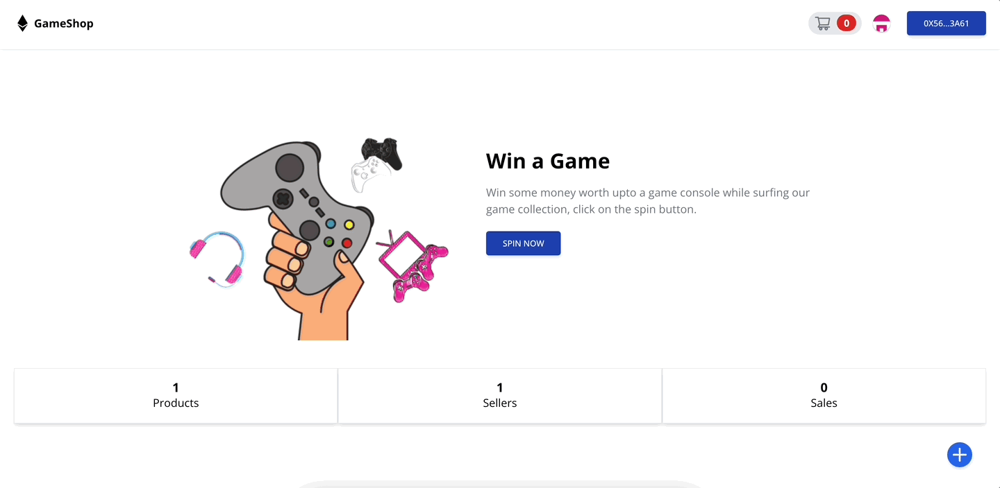
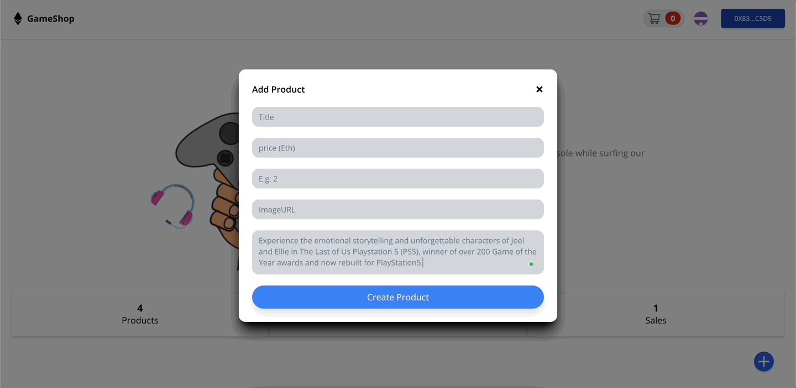
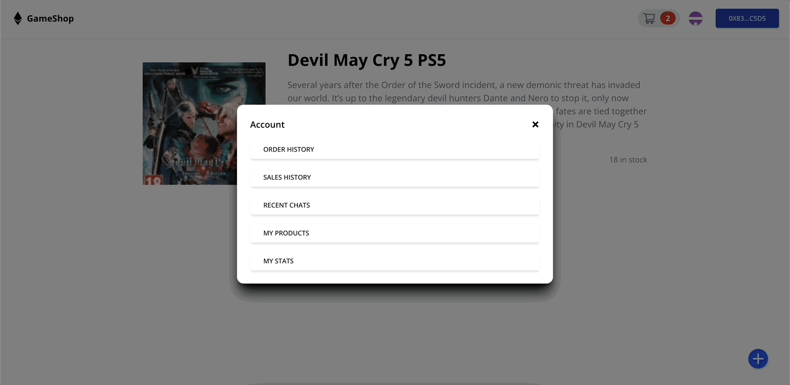
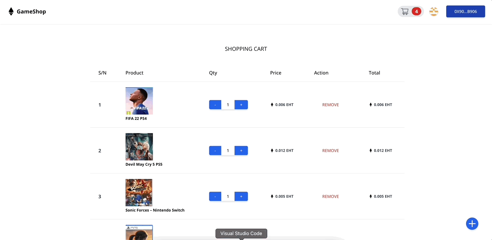

# How to Build a Fantastic Web3 Game Sales Shop with React and Solidity

Read the full tutorial here: [**>> How to Build a Fantastic Web3 Game Sales Shop with React and Solidity**](https://daltonic.github.io)

This example shows How to Build a Fantastic Web3 Game Sales Shop with React and Solidity:


<center><figcaption>Game Products</figcaption></center>


<center><figcaption>Add Product</figcaption></center>



<center><figcaption>Cancel Orders</figcaption></center>


<center><figcaption>Placing Orders</figcaption></center>

## Technology

This demo uses:

- Metamask
- Hardhat
- Alchamy
- ReactJs
- Tailwind CSS
- Solidity
- EthersJs
- Faucet

## Running the demo

To run the demo follow these steps:

1. Clone the project with the code below.
    ```sh

    # Make sure you have the above prerequisites installed already!
    git clone https://github.com/Daltonic/tailwind_ethers_starter_kit gameShop
    cd gameShop # Navigate to the new folder.
    yarn install # Installs all the dependencies.
    ```
2. Create an Alchemy project, copy and paste your key in the spaces below.
2. Update the `.env` file with the following details.
    ```sh
    ENDPOINT_URL=<PROVIDER_URL>
    DEPLOYER_KEY=<YOUR_PRIVATE_KEY>
    ```
3. Run the app using `yarn start`
<br/>

If your confuse about the installation, check out this **TUTORIAL** to see how you should run it.

Questions about running the demo? [Open an issue](https://github.com/Daltonic/gameshop/issues). We're here to help ✌️

## Useful links

- 🏠 [Website](https://daltonic.github.io/)
- ⚽ [Metamask](https://metamask.io/)
- 🚀 [Remix Editor](https://remix.ethereum.org/)
- 💡 [Hardhat](https://hardhat.org/)
- 📈 [Alchamy](https://www.alchemy.com/)
- 🔥 [ReactJs](https://reactjs.org/)
- 🐻 [Solidity](https://soliditylang.org/)
- 👀 [Ethersjs](https://docs.ethers.io/v5/)
- 🎅 [Faucet](https://goerli-faucet.pk910.de/)
- ✨ [Live Demo](https://gameshop-af682.web.app/)